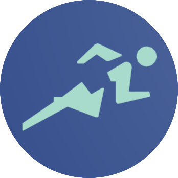

# Fitshare - A fitness program sharing app

## Our interpretation of the Project owner desired application
The application sought by the product owner is a fitness program sharing app. The program is intended to allow users to create their own fitness goals, detailing what they aim to achieve through their workouts. Users should be able to create workout plans, featuring specific sessions and exercises, and view their own progress towards these goals using their own or others' training plans. While the essence of the program is to reach one's fitness goals, there is also a social aspect involved. Users should be able to view what other users have created and find inspiration in others' plans and their progress. There should be an option to join fitness communities where members collectively motivate each other to reach a common fitness goal and view their own and others' progress. These groups should also have functionality to moderate themselves to ensure a better user experience. Once the product possesses sufficient functionality, there should be opportunities for advertisers to place advertisements.

## Techstack
The choice of the tech stack for the project was carefully considered to ensure a smooth development process and rapid delivery of value to the customer, in line with agile principles (Beck, K, et al, 2001). Frontend development was based on JavaScript and the React framework, a choice made to leverage easy modifiability and reuse of components, compared to the other option, JavaFX. For backend development, Java with Spring-Boot was chosen for its robustness, strong type safety, and extensive documentation, despite the temptation of a uniform JavaScript codebase using TypeScript. MongoDB was selected as the database for the project over relational alternatives like MySQL, thanks to its horizontal scaling and flexibility in requirement changes (IBM, 2023). Together, these technologies create a stack that is well-suited to address the product needs, and with the team’s experience in these technologies, the path to productivity becomes shorter and more efficient.

## Background and Context
Embarking on a journey to develop a fitness program sharing app, our team engaged in a software development project within the course TDT4140. Spanning over three sprints, each lasting two weeks, the endeavor sought to translate the product owner's vision into a functional application, prioritizing a user-friendly interface and socially-driven functionality in the realm of fitness and workout planning. Diving into this project was a wild, enlightening ride into the world of agile methodology! We learned the paramount importance of regular reflections, afforded by sprint retrospectives, which enabled us to perpetually refine our approaches and ameliorate potential pitfalls identified in previous sprints. Those sprint retrospectives became key. They were our time to hit pause, look back at what worked (and what didn’t). They were our time to reflect on how we could improve our processes and our product. They were our time to celebrate our successes and learn from our failures. They were our time to grow as a team.

## Authors and acknowledgment
The team whom created Fitshare consists of:
* Eirin Helseth
* Håvard Solberg Nybøe
* Martine Nilsen
* Skage Klingstedt Reistad
* Sverre Nystad
* Vidar Selnes Lund
  
Thank you all for a great semester, and all the hours spent together!